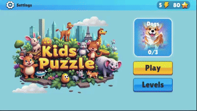
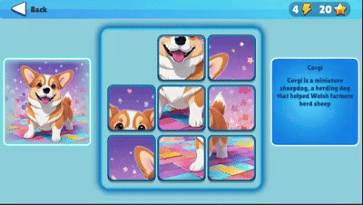

# FivesGame

A casual swap-puzzle game and a modernization case study for production-oriented Unity development.

## Current version

The imported baseline contains a complete player loop:

- swap-puzzle gameplay: exchange neighboring fragments to restore the picture;
- themes and puzzle selection;
- energy and star currencies;
- player progress and local save data;
- menus, settings, audio, transitions, and rewards.

It was originally created as a two-week test assignment and is now maintained with Unity 6.0 (6000.0.71f1), LeoECS, VContainer, UniTask, DOTween, uGUI, TextMesh Pro, and JSON persistence.

## Modernization direction

Development now focuses on a compact, verifiable architecture:

- ECS gameplay systems with deterministic pure-C# board rules;
- atomic moves, Undo/Redo, and seeded daily challenges;
- versioned saves with migrations and corruption recovery;
- explicit async and resource ownership;
- Addressables, RU/EN localization, and modern input;
- EditMode/PlayMode tests, CI artifacts, and measured performance budgets.

See the [baseline report](docs/BASELINE.md), [audit summary](docs/AUDIT.md), [target architecture](docs/ARCHITECTURE.md), and [roadmap](docs/ROADMAP.md).

## Open and build

1. Install Unity **6000.0.71f1** with Android Build Support, SDK, NDK, and OpenJDK.
2. Add this directory as a project.
3. Let Unity Package Manager restore the locked dependencies.
4. Open `Assets/Scenes/MainGame.unity`.
5. Build an Android App Bundle from `FivesGame > Build > Android App Bundle`.

The project targets Android only. The automated entry point is `Fives.Editor.AndroidBuild.BuildRelease`; its default output is `Builds/Android/FivesGame.aab`.

## Git Flow

- `main` contains stable, demonstrable releases.
- `develop` integrates the next release.
- `feature/*` branches start from and merge into `develop`.
- `release/*` stabilizes a version before `main`.
- `hotfix/*` starts from `main` and merges back into both `main` and `develop`.

See [CONTRIBUTING.md](CONTRIBUTING.md) for commit and pull-request rules.

## Verification status

Gameplay now uses a seeded board owned by an ECS entity. Systems handle input,
Undo/Redo, projection, animation and completion. The current unfinished attempt
has touch controls for Undo and Redo; persistence/share codes and daily challenges
remain future work. No separate application-session layer was introduced.

Unity's Test Runner (EditMode) runs **117 tests, all passing** in 6000.0.71f1 as of 2026-09-24:
59 domain tests (`Fives.Domain.Tests`), 54 runtime tests on the real ECS systems, services and
presenters (`Fives.Runtime.Tests`) and 4 gameplay prefab tests (`Fives.UI.Editor.Tests`).
Android builds and device profiling remain unverified.

The Kids Puzzle visual redesign replaces Riverside Village. Undo/Redo controls are
serialized in `GamePlayScreen.prefab`; the view no longer builds UI at runtime.

See [the board contract and acceptance steps](docs/BOARD_STATE.md),
[ECS architecture](docs/ARCHITECTURE.md) and [test commands](tools/domain-tests/README.md).
The domain-only GitHub Actions workflow automatically runs on Linux and Windows
for pushes and pull requests; it does not build Android or run the Unity EditMode tests,
which need a Unity license.

## Licensing

A project-wide license has not been selected yet. Third-party packages and imported media retain their own terms. See [THIRD_PARTY_NOTICES.md](THIRD_PARTY_NOTICES.md); unresolved media provenance blocks a public store release.
