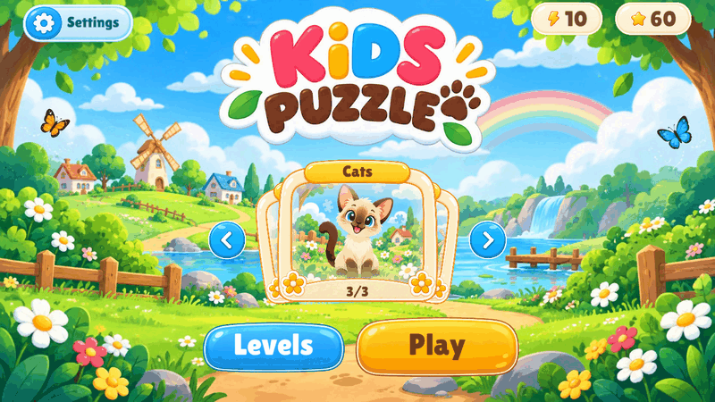
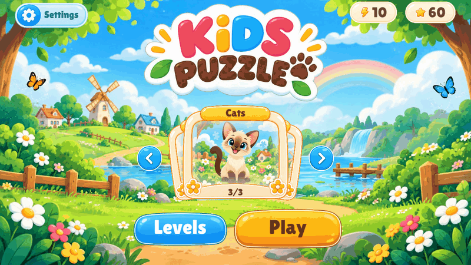

# FivesGame

A swap-puzzle game for kids on Unity 6, and a case study in building a production-style Unity project.

**[Play in the browser](https://vircatodev.github.io/FivesGame/)**




## How it was made

FivesGame started as a two-week test assignment: a small puzzle where you swap neighbouring fragments until the
picture comes back. Later I used it to answer a bigger question: what does a production-grade Unity project look like
when one developer works together with an AI agent?

**The architecture is mine.** I came up with the concept and the structure of the code:

- an ECS core (LeoECS): the board and every move are data, and systems process them;
- MVP screens: views only draw, and presenters talk to them through interfaces;
- a state machine that decides which screen is open;
- a pure C# domain with the board rules, shuffle, hints, economy and save migration, in its own assembly without a
  single Unity reference;
- assemblies and dependency-injection scopes (VContainer) that keep these layers apart.

**The agent did the typing.** This is the age of AI, so to move faster I paired with an agent: Claude Opus 5.5 by
Anthropic, in Claude Code. I set the direction and the rules; the agent wrote the code, tests and documentation to
them.

**Agents reviewed the code, too.** We built an agent-based review loop for the refinements. A review pass reads the
project through one lens at a time and reports findings with file and line:

- correctness and hidden defects;
- KISS, DRY and SOLID;
- the Unity lifecycle;
- architecture boundaries.

Every finding I accepted became a small branch with its own tests. When I disagreed, the decision went into a
[decision record](docs/adr).

**Nothing got in without me.** The agent worked in its own branch and was not allowed to commit anything that had not
passed the build and the whole test suite. I read every change, checked it in the game and accepted it myself.

**What was generated:**

- by the agent from my specifications, reviewed by me: the test suite, the documentation and the code comments;
- with ChatGPT: the art, both the puzzle pictures and the interface.

### Philosophy

- A person owns the architecture and every decision; the agent speeds up the work.
- Every rule has a test, and every non-obvious decision is written down.
- Small steps: one focused change, one review, one commit.
- AI is a tool, not an author: responsibility for what ships stays with the developer.

## The game

A complete player loop:

- swap-puzzle gameplay: exchange neighbouring fragments of a 4×3 board to restore the picture, with Undo and a hint
  for 5 stars that shows the route of one tile;
- themes and puzzle selection;
- energy and star currencies;
- player progress and local save data;
- settings for sound, music and language: English, Russian, French, Italian, German and Spanish;
- rewards, doubled for a watched ad on Android.

Built with Unity 6.0 (6000.0.71f1), LeoECS, VContainer, UniTask, DOTween, uGUI, TextMesh Pro, Addressables, Unity
Localization, Remote Config, LevelPlay and JSON persistence.

## Architecture

- Pure C# rules in `Fives.Domain` (board, seeded shuffle, hints, economy, save migration) with no Unity references;
  their tests also run in CI with `dotnet test`.
- LeoECS gameplay: the board entity is the run, and systems handle input, Undo, hints, animation and completion.
- Two VContainer scopes: the Boot scene loads the balance, the save, the texts and the themes in explicit steps; the
  MainGame scene holds the ECS world and the screens.
- MVP screens: presenters see views only through interfaces and are tested without scenes.
- Remote content and balance: theme bundles on GitHub Pages, Remote Config, six languages, rewarded ads for children
  on Android.

Read more: [architecture](docs/ARCHITECTURE.md), [decisions](docs/adr), [content](docs/CONTENT.md),
[localization](docs/LOCALIZATION.md), [ads](docs/ADS.md), [tests](docs/TESTS.md) and
[the board contract](docs/BOARD_STATE.md).

## Open and build

1. Install Unity **6000.0.71f1** with Android Build Support (SDK, NDK, OpenJDK) and Web Build Support.
2. Add this directory as a project.
3. Let Unity Package Manager restore the locked dependencies.
4. Open `Assets/Scenes/Boot.unity`; Play Mode always starts from it, as a build does.

Builds are made from the `FivesGame > Build` menu or from the terminal. Unity batch mode uses the
editor license on this machine, so close the project in the editor first:

```sh
tools/unity.sh test      # EditMode tests, prints total/passed/failed
tools/unity.sh apk       # Android APK into Builds/Android/FivesGame.apk
tools/unity.sh webgl     # WebGL build into Builds/WebGL
tools/unity.sh publish   # push Builds/WebGL to the gh-pages branch served by GitHub Pages
```

The Android entry point is `Fives.Editor.AndroidBuild.BuildRelease`: an APK by default,
an App Bundle when `-buildPath` ends with `.aab`.

## Git Flow

- `main` contains stable, demonstrable releases.
- `develop` integrates the next release.
- `feature/*` branches start from and merge into `develop`.
- `release/*` stabilizes a version before `main`.
- `hotfix/*` starts from `main` and merges back into both `main` and `develop`.

See [CONTRIBUTING.md](CONTRIBUTING.md) for commit and pull-request rules.

## Tests

Unity's Test Runner (EditMode) has **158 tests**:

- 33 domain tests (`Fives.Domain.Tests`);
- 99 runtime tests on the real ECS systems, services and presenters (`Fives.Runtime.Tests`);
- 26 editor checks of prefabs, localization and screen sizes (`Fives.UI.Editor.Tests`).

[The test map](docs/TESTS.md) lists what each group covers and how to write a new test; see also
[test commands](tools/domain-tests/README.md).

The GitHub Actions workflow runs the domain tests on Linux and Windows for every push and pull request, and checks the
prefab and scene format. It does not build Android or run the Unity tests, which need a Unity license. Android device
profiling is not done yet.

## Licensing

A project-wide license has not been selected yet. Third-party packages retain their own terms, and the artwork was
generated with ChatGPT. See [THIRD_PARTY_NOTICES.md](THIRD_PARTY_NOTICES.md): the sounds and the font still need their
provenance recorded before a store release.
